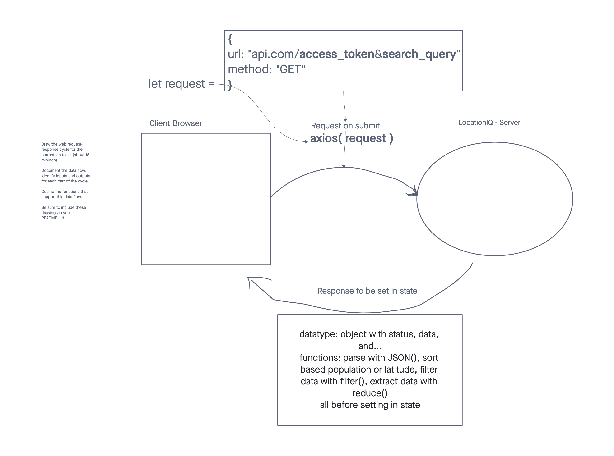

# City Explorer

**Author**: Kawika Miller

**Version**: 1.0.4 
<!-- (increment the patch/fix version number if you make more commits past your first submission) -->

## Overview
This application will allow a user to query various APIs about a specified location (e.g. city, state, etc.) and receive relevant information about that area such as its geographic information or the restaurants &/o businesses in the area.

## Getting Started

Deployed Site: https://kmartwork-city-explorer.netlify.app/

## Architecture
This application utilizes JavaScript, React, Bootstrap, and Node

## Change Log
**2023-02-20** : Initialize project

**2023-02-20** : Add search bar and show results

**2023-02-21** : Able to view weather results via request to local server .json file

**2023-02-22** : Able to view weather results & movies results via proxy request | client > server > 3rd party API

**2023-02-23** : Adjust CSS styling for whole site, add navbar and footer, move search to `<main>` element

**2023-02-24** : Display 'last updated' time | Last time data was updated via API call

## Credit and Collaborations
Jacob Basset: Lab06 - WRRC Wireframing

---

# Weekly Lab Information

## Lab 06 - Feb. 02, 2023

### Wireframing

Planning WRRC logic with Jacob Basset

### Time Estimates

#### **Task 01 - Set Up React Repo & API Keys**

Estimate of time needed to complete: 20m

Start time: 3:15PM

Finish time: 3:40PM

Actual time needed to complete: 25m

#### **Task 02 - Locations**

Estimate of time needed to complete: 45m

Start time: 3:45

Finish time: 5:00PM

Actual time needed to complete: 75m

#### **Task 03 - Map**

Estimate of time needed to complete: 30m

Start time: 5:30

Finish time: 6:20PM

Actual time needed to complete: 50m

*At some point my Access Token stopped working and I was getting 403 errors so I had to troubleshoot that. I ended up renewing my access token and for some reason I had to add 'http://localhost/3000' to my list of HTTP referrers even though just 'localhost' was working for the first half of the lab? 

#### **Task 04 - Errors**

Estimate of time needed to complete: 5m

Start time: 6:25PM

Finish time: 6:28PM

Actual time needed to complete: 3m

*I was already storing error messages in state so I just needed to implement some conditional logic to display the error

---

### Lab 07 - 08 in Back-End README

[Back-End README](https://github.com/KMArtwork/city-explorer-api/blob/main/README.md)

---

### Lab 09 - Refactoring

***Task 01 in [Back-End README](https://github.com/KMArtwork/city-explorer-api/blob/main/README.md)***

#### **Task 02 - Refactor Front End**

Estimate of time needed to complete: 5m

Start time: 2:10PM

Finish time: 2:13PM

Actual time needed to complete: 3m

*I actually ended up doing this last night without realizing this was what today's lab was supposed to be all about. The weather is rendered as a 7 day forecast using bootstrap's modal and card components and the movies are rendered using bootstrap's modal and carousel components.

---

### Lab 10 - Performance

#### **Task 01 - Display Timestamp**

Estimate of time needed to complete: 20m

Start time: 4:10PM

Finish time: 4:33PM

Actual time needed to complete: 23m

-----------------------
# Getting Started with Create React App

This project was bootstrapped with [Create React App](https://github.com/facebook/create-react-app).

## Available Scripts

In the project directory, you can run:

### `npm start`

Runs the app in the development mode.\
Open [http://localhost:3000](http://localhost:3000) to view it in your browser.

The page will reload when you make changes.\
You may also see any lint errors in the console.

### `npm test`

Launches the test runner in the interactive watch mode.\
See the section about [running tests](https://facebook.github.io/create-react-app/docs/running-tests) for more information.

### `npm run build`

Builds the app for production to the `build` folder.\
It correctly bundles React in production mode and optimizes the build for the best performance.

The build is minified and the filenames include the hashes.\
Your app is ready to be deployed!

See the section about [deployment](https://facebook.github.io/create-react-app/docs/deployment) for more information.

### `npm run eject`

**Note: this is a one-way operation. Once you `eject`, you can't go back!**

If you aren't satisfied with the build tool and configuration choices, you can `eject` at any time. This command will remove the single build dependency from your project.

Instead, it will copy all the configuration files and the transitive dependencies (webpack, Babel, ESLint, etc) right into your project so you have full control over them. All of the commands except `eject` will still work, but they will point to the copied scripts so you can tweak them. At this point you're on your own.

You don't have to ever use `eject`. The curated feature set is suitable for small and middle deployments, and you shouldn't feel obligated to use this feature. However we understand that this tool wouldn't be useful if you couldn't customize it when you are ready for it.

## Learn More

You can learn more in the [Create React App documentation](https://facebook.github.io/create-react-app/docs/getting-started).

To learn React, check out the [React documentation](https://reactjs.org/).

### Code Splitting

This section has moved here: [https://facebook.github.io/create-react-app/docs/code-splitting](https://facebook.github.io/create-react-app/docs/code-splitting)

### Analyzing the Bundle Size

This section has moved here: [https://facebook.github.io/create-react-app/docs/analyzing-the-bundle-size](https://facebook.github.io/create-react-app/docs/analyzing-the-bundle-size)

### Making a Progressive Web App

This section has moved here: [https://facebook.github.io/create-react-app/docs/making-a-progressive-web-app](https://facebook.github.io/create-react-app/docs/making-a-progressive-web-app)

### Advanced Configuration

This section has moved here: [https://facebook.github.io/create-react-app/docs/advanced-configuration](https://facebook.github.io/create-react-app/docs/advanced-configuration)

### Deployment

This section has moved here: [https://facebook.github.io/create-react-app/docs/deployment](https://facebook.github.io/create-react-app/docs/deployment)

### `npm run build` fails to minify

This section has moved here: [https://facebook.github.io/create-react-app/docs/troubleshooting#npm-run-build-fails-to-minify](https://facebook.github.io/create-react-app/docs/troubleshooting#npm-run-build-fails-to-minify)
